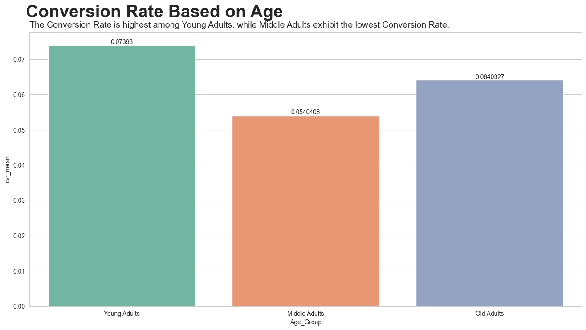
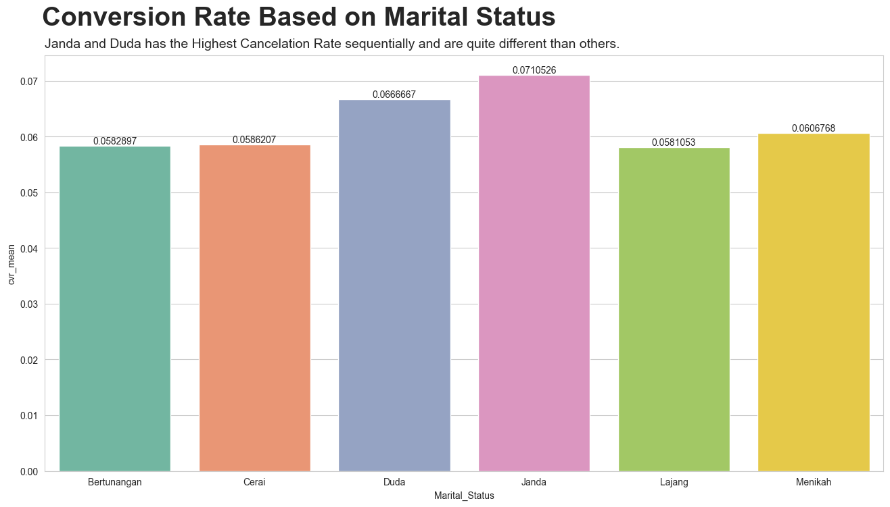
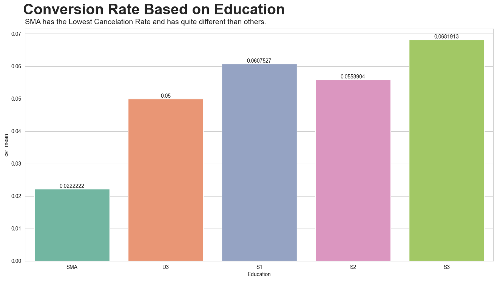
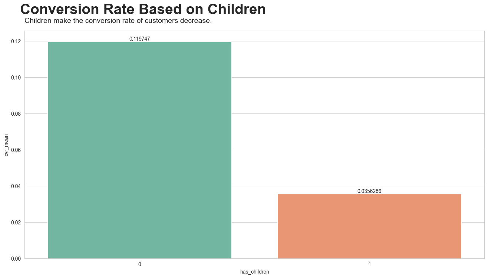
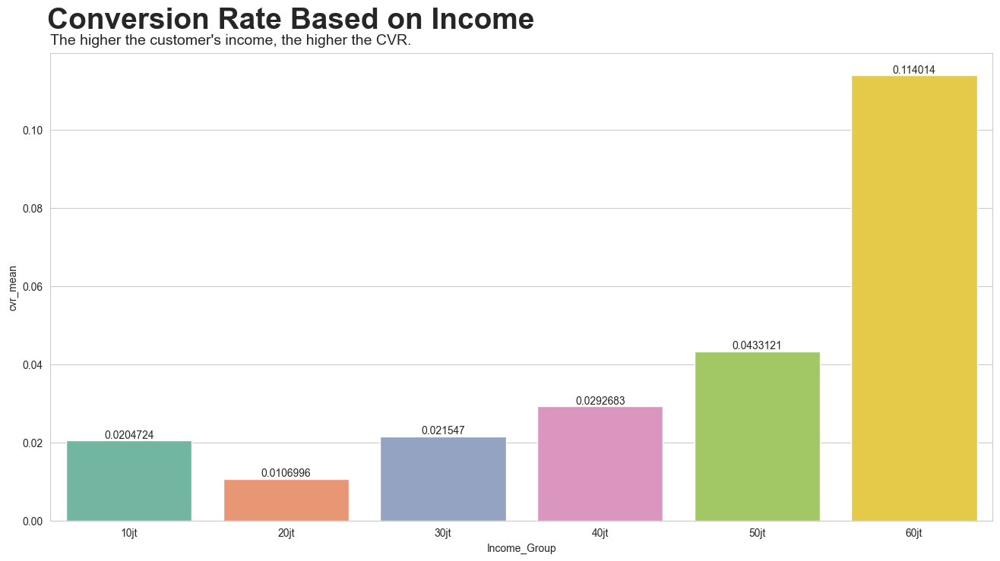
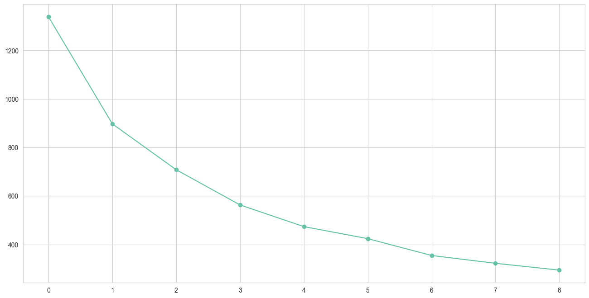
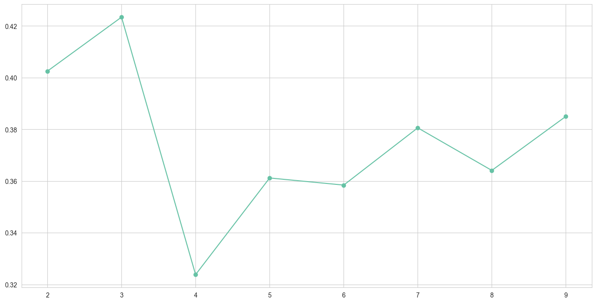
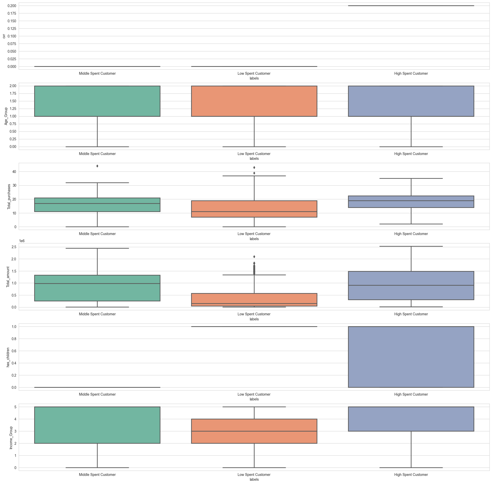

# Predict Customer Personality To Boost Marketing Campaign By Using Machine Learning

## Stage 0: Overview
Understanding the personality and behavior of customers is crucial for a company's rapid development. This knowledge enables the provision of improved services and benefits to customers, fostering loyalty. Leveraging historical marketing campaign data for performance enhancement and targeted customer engagement is a valuable strategy. In this project, the focus is on creating a cluster prediction model, utilizing insights from historical data to facilitate informed decision-making for the company. This project is organized into several stages, which include:
- Stage 1: Conversion Rate Analysis 
- Stage 2: Data Cleaning & Preprocessing
- Stage 3: Data Modeling
- Stage 4: Analysis of Customer Personality For Marketing Retargeting

### Data Understanding
Because there is no explanation about data, so I took the explanation from [Kaggle](https://www.kaggle.com/datasets/imakash3011/customer-personality-analysis). The following is an explanation from every column:
**People**
- ID: Customer's unique identifier
- Year_Birth: Customer's birth year
- Education: Customer's education level
- Marital_Status: Customer's marital status
- Income: Customer's yearly household income
- Kidhome: Number of children in customer's household
- Teenhome: Number of teenagers in customer's household
- Dt_Customer: Date of customer's enrollment with the company
- Recency: Number of days since customer's last purchase
- Complain: 1 if the customer complained in the last 2 years, 0 otherwise

**Products**
- MntCoke: Amount spent on coke in last 2 years
- MntFruits: Amount spent on fruits in last 2 years
- MntMeatProducts: Amount spent on meat in last 2 years
- MntFishProducts: Amount spent on fish in last 2 years
- MntSweetProducts: Amount spent on sweets in last 2 years
- MntGoldProds: Amount spent on gold in last 2 years

**Promotion**
- NumDealsPurchases: Number of purchases made with a discount
- AcceptedCmp1: 1 if customer accepted the offer in the 1st campaign, 0 otherwise
- AcceptedCmp2: 1 if customer accepted the offer in the 2nd campaign, 0 otherwise
- AcceptedCmp3: 1 if customer accepted the offer in the 3rd campaign, 0 otherwise
- AcceptedCmp4: 1 if customer accepted the offer in the 4th campaign, 0 otherwise
- AcceptedCmp5: 1 if customer accepted the offer in the 5th campaign, 0 otherwise
- Response: 1 if customer accepted the offer in the last campaign, 0 otherwise

**Place**
- NumWebPurchases: Number of purchases made through the company’s website
- NumCatalogPurchases: Number of purchases made using a catalogue
- NumStorePurchases: Number of purchases made directly in stores
- NumWebVisitsMonth: Number of visits to company’s website in the last month

## Stage 1: Conversion Rate Analysis 
Before data preprocessing is carried out, feature engineering is carried out. There are several engineering features carried out including the following:
- **Age** obtained by calculating year now - Year_Birth
- **Age Group** obtained by categorizing the age with some categories Young Adults, Middle Adults, and Old Adults.
- **Total Purchases** obtained by calculating columns NumDealsPurchases, NumWebPurchases, NumCatalogPurchases, and NumStorePurchases.
- **Total Amount** Spent obtained by calculating columns MntCoke, MntFruits, MntMeatProducts, MntFishProducts, MntSweetProducts, and MntGoldProds.
- **Total Children** obtained by calculating columns Kidhome and Teenhome.
- **has_children** obtained from the total children column.
- **Income_Group** obtained  by categorizing the Income with the division of 10.000.000 into 10jt, 20jt, 30jt, etc.
-  **Total_AcceptedCmp** obtained by calculating column AcceptedCmp1, AcceptedCmp2, AcceptedCmp3, AcceptedCmp4, and AcceptedCmp5.
- **cvr** obtained by calculating the column "Total_AcceptedCmp" as the number of responses and 5 as the number of visits (Total Campaign)

For further analysis of the conversion rate, we can do some analysis as follows:
### Conversion Rate based on Age

Young Adults demonstrate the highest Conversion Rate. The assumption is based on the assumption that younger individuals may be more inclined to take advantage of the campaign compared to Old and Middle Adults. This is because Young Adults prioritize saving money for future needs.
### Conversion Rate based on Marital Status

"Janda" and "Duda" show the highest Cancelation Rate sequentially, and they significantly differ from others. The assumption is that these categories may be more inclined to take advantage of campaigns compared to others.
### Conversion Rate based on Education

SMA may not have essential many needs and doesn't have much income do they have the least CVR.
### Conversion Rate based on Children

The presence of children among customers often leads to a greater focus on saving money, making them more discerning in their purchasing decisions. As a result, customers with children tend to have a much lower Conversion Rate (CVR) compared to those without children. The additional financial responsibilities associated with raising a family may contribute to a more cautious and selective approach to spending among customers with children.
### Conversion Rate based on Income

There is a positive correlation between a customer's income level and their Conversion Rate (CVR). As the customer's income increases, the likelihood of conversion also tends to rise. This suggests that customers with higher incomes may be more willing or able to make purchases so more take the campaign, contributing to a higher CVR compared to those with lower incomes.

## Stage 2: Data Cleaning & Preprocessing
Prepare the raw data, transforming it into clean data. This is a crucial process so that the data used can produce better models. The preprocessing carried out consists of several stages, below are the details of the preprocessing carried out:
|Preprocessing|Finding|Handling|Explanation|
|-------------|-------|--------|-----------|
|Duplicate Value|-|-|-|
|Missing Value|There are 24 rows in the Income column with missing data (Null values)|Drop|The amount is only small (1%)|
|Feature Selection|There are columns that are already represented by other columns, so just some columns will be kept for the further process including 'Education', 'Marital_Status', 'cvr', 'Age_Group', 'Total_purchases', 'Total_amount', 'has_children', 'Income_Group', and 'Total_AcceptedCmp'.|Drop|-|
|Feature Encoding|**Education, Income_Group, and Age_Group** have **levels**.     **Marital_Status** all categories are the same (**no levels**)|**Education, Income_Group, and Age_Group** use **Label Encoding**   **Marital_Status** uses **One Hot Encoding**|-|
|Handling Outlier|There are two columns, namely "cvr" and "Total_AcceptedCmp" with abnormal outliers.|Using Z-Score|To address this issue and minimize the impact of missing data|
|Feature Scaling|Not all columns exhibit a Gaussian/normal distribution|MinMaxScaler|Because K-means clustering as it is more suitable|

## Stage 3: Data Modeling
For clustering models, K-Means clustering will be utilized, and here are the results:

- Inertia

According to the elbow method, the inertia changes significantly up to 3 clusters, and thereafter, the changes become less pronounced. So I have opted to use 3 clusters for this model.

- Silhouette Score

The silhouette score analysis indicates that 3 clusters have the highest scores compared to other cluster options. Therefore, it can be concluded that using 3 clusters yields the best results for this model.

<table border="1" class="dataframe">
  <thead>
    <tr>
      <th></th>
      <th>labels</th>
      <th colspan="4" halign="left">Education</th>
      <th colspan="4" halign="left">cvr</th>
      <th colspan="4" halign="left">Age_Group</th>
      <th colspan="4" halign="left">Total_purchases</th>
      <th colspan="4" halign="left">Total_amount</th>
      <th colspan="4" halign="left">has_children</th>
      <th colspan="4" halign="left">Income_Group</th>
      <th colspan="4" halign="left">Marital_Status_Bertunangan</th>
      <th colspan="4" halign="left">Marital_Status_Cerai</th>
      <th colspan="4" halign="left">Marital_Status_Duda</th>
      <th colspan="4" halign="left">Marital_Status_Janda</th>
      <th colspan="4" halign="left">Marital_Status_Lajang</th>
      <th colspan="4" halign="left">Marital_Status_Menikah</th>
    </tr>
    <tr>
      <th></th>
      <th></th>
      <th>min</th>
      <th>max</th>
      <th>median</th>
      <th>mean</th>
      <th>min</th>
      <th>max</th>
      <th>median</th>
      <th>mean</th>
      <th>min</th>
      <th>max</th>
      <th>median</th>
      <th>mean</th>
      <th>min</th>
      <th>max</th>
      <th>median</th>
      <th>mean</th>
      <th>min</th>
      <th>max</th>
      <th>median</th>
      <th>mean</th>
      <th>min</th>
      <th>max</th>
      <th>median</th>
      <th>mean</th>
      <th>min</th>
      <th>max</th>
      <th>median</th>
      <th>mean</th>
      <th>min</th>
      <th>max</th>
      <th>median</th>
      <th>mean</th>
      <th>min</th>
      <th>max</th>
      <th>median</th>
      <th>mean</th>
      <th>min</th>
      <th>max</th>
      <th>median</th>
      <th>mean</th>
      <th>min</th>
      <th>max</th>
      <th>median</th>
      <th>mean</th>
      <th>min</th>
      <th>max</th>
      <th>median</th>
      <th>mean</th>
      <th>min</th>
      <th>max</th>
      <th>median</th>
      <th>mean</th>
    </tr>
  </thead>
  <tbody>
    <tr>
      <th>0</th>
      <td>0</td>
      <td>0</td>
      <td>4</td>
      <td>2.0</td>
      <td>2.377778</td>
      <td>0.0</td>
      <td>0.0</td>
      <td>0.0</td>
      <td>0.0</td>
      <td>0</td>
      <td>2</td>
      <td>1.0</td>
      <td>1.190123</td>
      <td>0</td>
      <td>44</td>
      <td>17.0</td>
      <td>16.083951</td>
      <td>6000</td>
      <td>2440000</td>
      <td>981000.0</td>
      <td>884069.135802</td>
      <td>0</td>
      <td>0</td>
      <td>0.0</td>
      <td>0.000000</td>
      <td>0</td>
      <td>5</td>
      <td>5.0</td>
      <td>3.772840</td>
      <td>0</td>
      <td>1</td>
      <td>0.0</td>
      <td>0.241975</td>
      <td>0</td>
      <td>1</td>
      <td>0.0</td>
      <td>0.086420</td>
      <td>0</td>
      <td>0</td>
      <td>0.0</td>
      <td>0.000000</td>
      <td>0</td>
      <td>1</td>
      <td>0.0</td>
      <td>0.041975</td>
      <td>0</td>
      <td>1</td>
      <td>0.0</td>
      <td>0.271605</td>
      <td>0</td>
      <td>1</td>
      <td>0.0</td>
      <td>0.358025</td>
    </tr>
    <tr>
      <th>1</th>
      <td>1</td>
      <td>0</td>
      <td>4</td>
      <td>2.0</td>
      <td>2.453402</td>
      <td>0.0</td>
      <td>0.0</td>
      <td>0.0</td>
      <td>0.0</td>
      <td>0</td>
      <td>2</td>
      <td>1.0</td>
      <td>1.213018</td>
      <td>0</td>
      <td>43</td>
      <td>11.0</td>
      <td>13.230769</td>
      <td>5000</td>
      <td>2092000</td>
      <td>158500.0</td>
      <td>358882.396450</td>
      <td>1</td>
      <td>1</td>
      <td>1.0</td>
      <td>1.000000</td>
      <td>0</td>
      <td>5</td>
      <td>3.0</td>
      <td>2.935651</td>
      <td>0</td>
      <td>1</td>
      <td>0.0</td>
      <td>0.266272</td>
      <td>0</td>
      <td>1</td>
      <td>0.0</td>
      <td>0.111686</td>
      <td>0</td>
      <td>1</td>
      <td>0.0</td>
      <td>0.001479</td>
      <td>0</td>
      <td>1</td>
      <td>0.0</td>
      <td>0.030325</td>
      <td>0</td>
      <td>1</td>
      <td>0.0</td>
      <td>0.197485</td>
      <td>0</td>
      <td>1</td>
      <td>0.0</td>
      <td>0.392751</td>
    </tr>
    <tr>
      <th>2</th>
      <td>2</td>
      <td>0</td>
      <td>4</td>
      <td>2.0</td>
      <td>2.523220</td>
      <td>0.2</td>
      <td>0.2</td>
      <td>0.2</td>
      <td>0.2</td>
      <td>0</td>
      <td>2</td>
      <td>1.0</td>
      <td>1.287926</td>
      <td>2</td>
      <td>35</td>
      <td>19.0</td>
      <td>17.767802</td>
      <td>12000</td>
      <td>2525000</td>
      <td>914000.0</td>
      <td>917185.758514</td>
      <td>0</td>
      <td>1</td>
      <td>1.0</td>
      <td>0.594427</td>
      <td>0</td>
      <td>5</td>
      <td>5.0</td>
      <td>3.904025</td>
      <td>0</td>
      <td>1</td>
      <td>0.0</td>
      <td>0.256966</td>
      <td>0</td>
      <td>1</td>
      <td>0.0</td>
      <td>0.105263</td>
      <td>0</td>
      <td>1</td>
      <td>0.0</td>
      <td>0.003096</td>
      <td>0</td>
      <td>1</td>
      <td>0.0</td>
      <td>0.037152</td>
      <td>0</td>
      <td>1</td>
      <td>0.0</td>
      <td>0.213622</td>
      <td>0</td>
      <td>1</td>
      <td>0.0</td>
      <td>0.383901</td>
    </tr>
  </tbody>
</table>

Based on the table interpretation, three clusters can be defined with the following characteristics:

- **Cluster 0:**
  - These customers never take the campaign.
  - Predominantly Middle Adults.
  - 17 total purchases with Rp. 884,069 total amount spent.
  - Income is Rp. 37,000,000.
  - None of the customers in this cluster have children.
  - Can be defined as **Middle Spent Customer**

- **Cluster 1:**
  - Customers in this cluster never take the campaign.
  - Predominantly Middle Adults.
  - Lowest total purchases (13 times) and lowest total amount spent (Rp. 358,882).
  - Lowest income of Rp. 29,000,000.
  - Every customer in this cluster has children.
  - Can be defined as **Low Spent Customer**

- **Cluster 2:**
  - This cluster is more likely to accept the campaign (20% acceptance rate).
  - Predominantly Old Adults.
  - Highest total purchases (18 times) and highest total amount spent (Rp. 917,185).
  - Highest income of Rp. 39,000,000.
  - Not every customer in this cluster has children.
  - Can be defined as **High Spent Customer**

  
  Based on the distribution for each cluster, there are unique patterns as follows:

- **Conversion Rate for the campaign:**
   - Only High Spend Customers have a 20% acceptance rate, while the others have a 0% rate.

- **Total purchases:**
   - Low Spend Customers exhibit a variation in total purchases, with the majority being low.

- **Total amount:**
   - Middle Spend and High Spend customers have similar distributions, but High Spend customers show a more centralized in the high total amount.

- **Has children:**
   - Good distribution across clusters. In Middle Spent, there are no customers with children (0), Low Spent has only 1, and High Spent has an equal distribution.

- **Income group:**
   - Each cluster shows a distribution from 0 to 5. Low Spent is centralized in the middle to low-income range, Middle Spent is centralized in the middle to high-income range, and High Spent is centralized in the high-income range.

### Marketing Retargetting and Potential Impact
Given that only **High Spent Customers** accepted the campaign, which is 20% acceptance rate, so company can focus the campaign on this specific customer segment allowing for a more targeted approach. This targeted strategy can lead to cost savings of up to 84.5% with the same total revenue and total amount purchased, as the campaign is directed towards the group that has shown a positive response in terms of spending and acceptance of our campaign. Lastly, 84.5% money can be used for researching why the low and middle spent customer doesn't accept our campaign.

### Business Recommendation
Business recommendations for each cluster are well-thought-out and strategic. Here's a summary:

- **Low Spent Customer:**
  - Importance of Personalization: Given the significant size of this cluster (65%), personalized products and campaigns are crucial to engage and retain customers.
  - In-depth Research: Conduct further research to understand why customers in this cluster have low total purchases and zero Conversion Rates (CVR). This knowledge can help in targeting and converting more valuable customers.

- **Middle Spent Customer:**
  - Personalized Campaigns: Although this cluster has income levels not significantly different from High Spent Customers, they have not accepted campaigns. Implement personalized campaigns by tracking their website behavior to encourage engagement and conversions.

- **High Spent Customer:**
  - Targeted Campaigns: Continue providing campaigns exclusively to this cluster, as they have shown a willingness to accept campaigns. Focus marketing efforts on this group to maximize campaign effectiveness. 

- **All Customers:**
  - Gamification Strategy: Implement a gamification strategy, such as assigning ranks (Bronze, Silver, Gold, etc.) based on purchases or accepted campaigns. Offer promotions, discounts, and rewards that align with each rank, aiming to boost excitement and encourage more purchases and campaign acceptances.